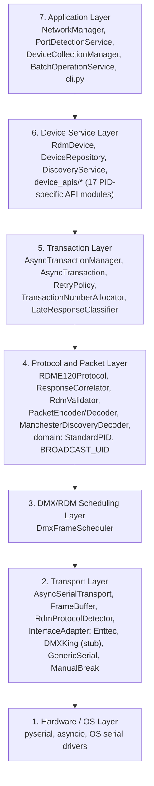
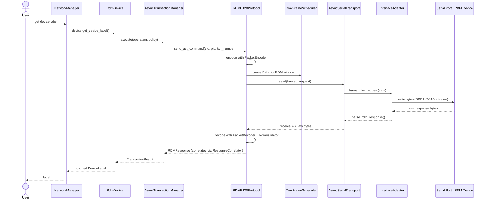

# rdm_dmx_async Architecture Documentation

## Overview
This document describes the 7-layer architecture of the rdm_dmx_async library, following SOLID principles and clean architecture patterns.

Note: the optional FastAPI REST API lives in the top-level `api/` folder, outside
the `rdm_dmx_async` package. It's a separate application that consumes the library
(same as `examples/`, `hardware_tests/`, `cli.py`) and is not part of this layering.
See `api/app.py`; requires the `api` extra (`pip install rdm-dmx-async[api]`).
A React frontend for this API lives in `frontend/` (Vite + TypeScript). See the
"Web UI" section in the top-level `README.md` for how to run both together.

## Architecture Layers

## Layer Responsibilities

### 1. Hardware / OS Layer
**Purpose**: Low-level system access
- Serial port communication via pyserial
- Async I/O via asyncio
- Hardware device enumeration

**Dependencies**: Python standard library, pyserial

### 2. Transport Layer
**Purpose**: Abstract hardware communication
- `AsyncSerialTransport`: Async serial communication with TX/RX queues, background read/write tasks
- `FrameBuffer`: Buffers and extracts complete frames from the RX byte stream, with stall-detection and overflow protection
- `RdmProtocolDetector`: Distinguishes discovery packets (DISC_UNIQUE_BRANCH/MUTE/UN_MUTE) from standard RDM packets by PID
- `InterfaceAdapter`: Abstract base for hardware-specific framing (`transport/interface_adapter.py`)
- Concrete adapters (`transport/adapters/`):
  - `EnttecAdapter`: ENTTEC USB PRO API v1.44 implementation (all message labels, widget parameter/serial number queries, discovery packet routing)
  - `ManualBreakAdapter`: Bare USB-RS485 (FTDI FT232R) interfaces with no onboard framing microcontroller - the host toggles the UART BREAK condition itself
  - `GenericSerialAdapter`: Simple serial framing patterns (line-based, length-prefix, delimiter, raw) for non-DMX serial devices
  - `DMXKingAdapter`: Placeholder/stub for DMXKing ultraDMX support - not yet implemented (all methods raise `NotImplementedError`)

**Key Files**:
- `transport/serial_transport.py`
- `transport/frame_buffer.py`
- `transport/protocol_detector.py`
- `transport/interface_adapter.py`
- `transport/base.py`
- `transport/adapters/enttec.py`, `transport/adapters/bare_usb_rs485.py`, `transport/adapters/generic_serial.py`, `transport/adapters/dmxking.py`

**SRP Compliance**: Each adapter handles only its device's framing; buffering, protocol detection, and I/O are separated into their own classes

### 3. DMX/RDM Scheduling Layer
**Purpose**: Timing control and bus arbitration
- `DmxFrameScheduler`: Controls DMX frame rate and timing, and pauses output for RDM request windows (`pause_for_rdm`), called directly by `RDME120Protocol`
- Break and Mark-After-Break timing coordination
- Prevents bus conflicts

**Key Files**:
- `scheduling/dmx_scheduler.py`

**SRP Compliance**: Scheduling separated from protocol operations

**ANSI E1.20 Compliance**:
- RDM packets sent between DMX frames
- Proper break-to-break timing maintained
- Response timeout handling (2-3ms typical)

### 4. Protocol and Packet Layer
**Purpose**: RDM protocol implementation and wire-format serialization
- `RDME120Protocol`: Core protocol operations - send/receive coordination, delegates correlation to `ResponseCorrelator` and validation to `RdmValidator`
- `ResponseCorrelator`: Matches responses to their originating requests via per-transaction-number futures, with a background cleanup loop for stale (30s) handlers
- `RdmValidator`: Request/response validation logic (E1.20 compliance rules)
- `ManchesterDiscoveryDecoder` / `find_discovery_frame_length`: Manchester-encoded DISC_UNIQUE_BRANCH response decoding
- `PacketEncoder` / `PacketDecoder`: RDM packet serialization (`packets/encoder.py`, `packets/decoder.py`)
- `RDMRequest` / `RDMResponse` / `RDMDiscoveryResponse`: Packet data structures (`packets/rdm.py`)
- `UID` / `PID` / `TransactionNumber` / `CommandClass`: Core wire-level value types (`packets/types.py`)
- `StandardPID` / `BROADCAST_UID`: Standard RDM parameter IDs and constants (`domain/parameters.py`) - a small shared-vocabulary module used by the protocol, transaction, and service layers alike

**Key Files**:
- `protocols/rdm_e120.py`
- `protocols/response_correlator.py`
- `protocols/rdm_validator.py`
- `protocols/manchester_codec.py`
- `packets/encoder.py`, `packets/decoder.py`, `packets/rdm.py`, `packets/types.py`
- `domain/parameters.py`

**SRP Compliance**:
- Protocol operations separated from correlation
- Validation extracted to dedicated class
- Encoding/decoding separated from protocol logic

> **Note**: There are two similarly-named but distinct classes - `protocols/response_correlator.py::ResponseCorrelator` (matches responses to in-flight requests via futures) and `transaction/correlator.py::LateResponseClassifier` (classifies whether a response belongs to the current or a previous retry attempt). They were previously both named `ResponseCorrelator`; the transaction-layer one was renamed to avoid confusion (see `docs/CODE_REVIEW_FINDINGS.md`).

### 5. Transaction Layer
**Purpose**: Reliable request/response handling
- `AsyncTransaction`: Individual transaction execution with retries
- `AsyncTransactionManager`: Orchestrates transactions using a shared allocator and protocol instance
- `LateResponseClassifier`: Detects late responses (from a previous retry attempt) vs. active/anomalous ones
- `RetryPolicy` (and presets `STANDARD_POLICY`, `AGGRESSIVE_RETRY_POLICY`, `NO_RETRY_POLICY`): Configurable retry strategies
- `TransactionNumberAllocator`: TXN number allocation/release
- `TransactionResult` / `TransactionState`: Result and state tracking for all attempts

**Key Files**:
- `transaction/async_transaction.py`
- `transaction/transaction_manager.py`
- `transaction/correlator.py`
- `transaction/policy.py`
- `transaction/allocator.py`
- `transaction/result.py`, `transaction/state.py`

**SRP Compliance**: Each component has single responsibility
- Late-response classification separated from transaction execution
- Retry logic separated from transaction execution
- TXN allocation separated from transaction management

**Features**:
- Automatic retries with backoff
- Late-response classification (no false correlation with stale attempts)
- Full per-attempt result tracking

### 6. Device Service Layer
**Purpose**: High-level device management
- `RdmDevice`: Clean device interface
  - Device state management, parameter caching
  - Delegates PID-specific operations to `device_apis/*`
  - Transaction coordination via `AsyncTransactionManager`
- `DeviceRepository`: Device collection management (registration, lookup, stale-device cleanup)
- `DiscoveryService`: Full binary-search RDM discovery, coordinates with `DeviceRepository` and `BinarySearchNode`
- `device_apis/*`: One module per PID group, each exposing a focused API (`DeviceControlAPI`, `DeviceInfoAPI`, `DeviceLabelAPI`, `DeviceMaintenanceAPI`, `DisplaySettingsAPI`, `DmxConfigAPI`, `DmxModesAPI`, `DmxSlotsAPI`, `LampControlAPI`, `PositionConfigAPI`, `PowerControlAPI`, `PresetControlAPI`, `ProxyAPI`, `SelfTestAPI`, `SensorDefinitionsAPI`, `SensorsAPI`, `SystemInfoAPI`)

**Key Files**:
- `services/rdm_device.py`
- `services/device_repository.py`
- `services/discovery_service.py`
- `services/binary_search.py`
- `services/device_apis/` (17 modules, one per PID group)

**SRP Compliance**:
- Device operations separated from repository management
- Discovery coordination separated from device logic
- Each PID group has its own dedicated API module rather than one large device class

**Domain-Driven Design**:
- `DeviceState` / `CachedParameter` for state snapshots and cache entries
- Repository pattern for collection management
- Service layer provides a clean, PID-grouped API for applications

### 7. Application Layer
**Purpose**: User-facing workflows and network orchestration
- `NetworkManager`: Network stack lifecycle and coordination (start/stop, adapter selection by `InterfaceType`)
- `PortDetectionService`: COM port detection and validation
- `DeviceCollectionManager`: Device collection tracking
- `BatchOperationService`: Multi-device concurrent operations
- `cli.py`: `rdm-dmx` console script for manual port-listing/discovery verification

**Key Files**:
- `application/network_manager.py`
- `application/port_detection_service.py`
- `application/device_collection_manager.py`
- `application/batch_operation_service.py`
- `cli.py`

**SRP Compliance**: Network lifecycle, port detection, device tracking, and batch operations are each a separate service rather than one monolithic manager

## SOLID Principles Applied

### Single Responsibility Principle (SRP)
- Protocol: Only send/receive coordination
- ResponseCorrelator: Only request/response correlation
- LateResponseClassifier: Only late-response classification
- RdmValidator: Only validation logic
- Encoder/Decoder: Only serialization
- Each `device_apis/*` module: Only one PID group's operations

### Open/Closed Principle (OCP)
- `InterfaceAdapter` is an abstract base, extended by `EnttecAdapter`, `ManualBreakAdapter`, `GenericSerialAdapter`, and `DMXKingAdapter`
- New hardware can be added without modifying existing transport or protocol code
- Retry policies are extensible via `RetryPolicy` base class

### Liskov Substitution Principle (LSP)
- Any `InterfaceAdapter` can substitute for another
- Any `AsyncTransport` can substitute for another
- Polymorphic hardware support

### Interface Segregation Principle (ISP)
- Separate interfaces for different concerns:
  - `AsyncTransport` for communication
  - `InterfaceAdapter` for hardware framing
  - `RdmValidator` for validation
  - `ResponseCorrelator` for correlation

### Dependency Inversion Principle (DIP)
- High-level modules depend on abstractions:
  - Protocol depends on `AsyncTransport` (abstract), not a concrete transport
  - `RDME120Protocol` only imports `TransactionNumberAllocator` under `TYPE_CHECKING` - it accepts one via constructor injection but has no runtime dependency on the transaction layer, avoiding a circular import
  - Service layer depends on `RDME120Protocol` (interface)
  - Application depends on services (not concrete implementations)
- Dependency injection throughout (constructor injection)

## Key Design Patterns

### Strategy Pattern
- `RetryPolicy`: Different retry strategies
- `InterfaceAdapter`: Different hardware framing protocols
- `FramingMode` (in `GenericSerialAdapter`): Different generic serial framing strategies (line-based, length-prefix, delimiter, raw)

### Repository Pattern
- `DeviceRepository`: Manages device collection
- Abstracts device persistence and lifecycle

### Adapter Pattern
- `InterfaceAdapter`: Adapts hardware-specific protocols to a common interface
- `EnttecAdapter`, `ManualBreakAdapter`, `GenericSerialAdapter`: Adapt their respective wire protocols

### Observer/Callback Pattern
- Response correlation uses Futures (async observer)
- Event-driven receive loops

### Factory Pattern
- Device creation via repository
- `NetworkManager._ADAPTER_FACTORIES`: Maps `InterfaceType` to adapter constructors

## Data Flow Example

Get a device's label end-to-end, through every layer:

## Benefits of This Architecture

### Testability
- Each layer can be tested independently
- Mock interfaces for unit testing
- Integration testing at layer boundaries

### Maintainability
- Clear separation of concerns
- Easy to locate bugs (layer isolation)
- Changes localized to specific layers

### Extensibility
- New hardware: Add an `InterfaceAdapter` implementation
- New PID groups: Add a `device_apis/*` module
- New features: Add to the appropriate layer

### Reusability
- Transport layer reusable for different protocols
- Protocol layer reusable for different transports
- Service layer provides clean API for applications

### Scalability
- Async throughout for high-performance
- Transaction layer handles concurrency
- Scheduling prevents bus conflicts

## Current Implementation Status

- ✅ All 7 layers implemented and covered by the automated test suite (277 tests, see `tests/`)
- ✅ Enttec USB PRO and bare USB-RS485 (FTDI FT232R) interfaces fully implemented and hardware-validated
- ✅ Full binary-search RDM discovery, transaction retries/late-response handling, and DMX/RDM scheduling covered by unit and E2E tests
- ✅ Optional FastAPI REST API (`api/`) and React frontend (`frontend/`) consume the library as an external application
- ⚠️ `DMXKingAdapter` is a placeholder - every method raises `NotImplementedError`; DMXKing ultraDMX support is not yet implemented
- ⚠️ `GenericSerialAdapter` explicitly does not support DMX512 output (`frame_dmx_output` raises `NotImplementedError`) - it is not currently a substitute for `ManualBreakAdapter`

## Next Steps

1. **DMXKing support**: Implement `DMXKingAdapter`'s framing, parsing, and frame-length detection (currently all stubbed)
2. **Adapter consolidation**: Evaluate whether `ManualBreakAdapter`'s raw DMX/RDM framing can be folded into `GenericSerialAdapter` as an additional `FramingMode`, or whether they should remain separate given `GenericSerialAdapter`'s current DMX-output restriction
3. **Documentation**: Keep this document in sync with the codebase as adapters and layers evolve

## References

- ANSI E1.20: RDM Protocol Standard
- ANSI E1.11: DMX512-A Standard
- ENTTEC DMX USB PRO API v1.44
- SOLID Principles (Robert C. Martin)
- Clean Architecture (Robert C. Martin)
